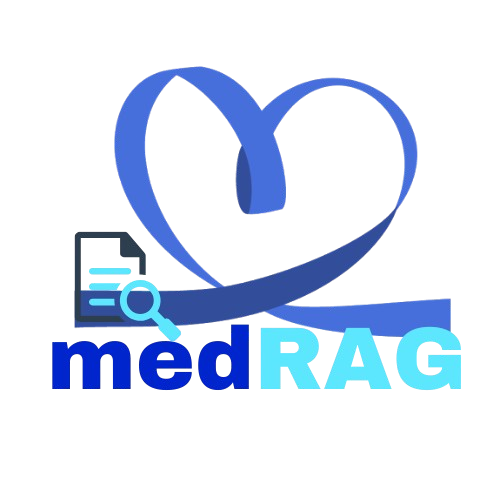

  

<h1 align="center">🧠 MedRAG: Medical Image Analysis & Retrieval-Augmented Generation</h1>

---

## 🔍 Overview

**MedRAG** is a flexible AI system designed for educational and research use in medical imaging, with a focus on chest X-rays. It combines three key functions:

* Interpreting chest X-rays using a fine-tuned model
* Generating step-by-step diagnostic reasoning
* Retrieving similar X-ray images for comparison and context

The system is trained specifically on the **NIH Chest X-ray Dataset**, making it suitable for thoracic imaging tasks such as identifying lung, pleural, and heart-related conditions. Retrieved reference images come from a local medical database and trusted online sources.

Yes, you can absolutely add that — and it's a great way to clarify the motivation behind the project while still keeping the disclaimer clear.

Here’s a clean, professional way to phrase and include it in your `README.md`:

---

## ⚡ Project Motivation

The core idea behind MedRAG is to reduce the manual effort doctors often spend searching for similar chest X-ray cases — whether in internal databases or on the web. By automating reasoning and retrieval, MedRAG aims to support medical education and streamline early stage investigation.

---

## 🩺 Project Vision

MedRAG aims to explore how AI can support medical decision-making by:

* Producing clear, structured diagnostic reasoning from chest X-ray images
* Finding similar cases from a local image database to support visual interpretation
* Fetching related medical images and content from the web to expand diagnostic context

---

## 🧱 Flow Diagram

---

## 🧱 System Architecture

---

---

## 🎥 Live Demo

---

## 🔄 MedRAG System Pipeline

### 🖥️ Frontend Layer: MedRAG Web UI

* Users submit a query or image through the web interface
* The query is forwarded to the backend for AI processing

---

### 🧠 AI Coordination Layer: MedRAG Agent

* Runs on an AWS EC2 instance
* Controls the full reasoning pipeline
* Based on input, the agent:

  * Sends the image to reasoning models
  * Extracts the disease name
  * Selects and invokes the appropriate tools (retrieval, web search, or both)

---

### 🧠 Stage 1 – Chest X-ray Analysis (SageMaker Endpoint 1)

#### 🔹 1. medGEMMA Reasoner

* **Input**: Chest X-ray image
* **Output**: A detailed, structured reasoning chain

#### 🔹 2. medGEMMA Summariser

* **Input**: Output from the reasoner
* **Output**: A diagnostic summary (e.g., disease name)

---

### 🔍 Stage 2 – Similar Case Retrieval (SageMaker Endpoint 2)

* **Tool**: medCLIP + FAISS
* **Input**: Disease label
* **Process**: Vector search in local image database
* **Output**: Top matching chest X-rays

---

### 🌐 Stage 3 – Web-Based Context Retrieval

* **Tool**: serpAPI
* **Input**: Disease label
* **Output**: Online medical images and articles for additional context

---

### 📤 Streaming Results to UI

The AI agent returns results in real time:

1. Reasoning explanation
2. Diagnostic summary
3. Retrieved similar images
4. Web-based content

All results are shown step by step in the web UI.

---

## 🧠 AI Agent Orchestration

The agent acts as the central controller for the MedRAG workflow. It performs the following:

### 🔁 Step-by-Step Flow:

1. **Input Handling**: Accepts image and/or query
2. **Reasoning**: Sends image to medGEMMA Reasoner
3. **Summarization**: Uses the Summariser to get the final disease label
4. **Tool Selection**:

   * medCLIP for local retrieval
   * serpAPI for web image and content search
5. **Response Streaming**: Sends each output step-by-step to the UI
6. **Domain Enforcement**: Only accepts medical queries; ignores unrelated input

---

## 🎯 Intended Use

MedRAG is designed only for **non-commercial educational and research purposes**. It is not validated for clinical use and should not be used for medical diagnosis or treatment planning.

---

## 🛠️ Technologies & Tools Used

### 💻 Core Frameworks & Infrastructure

| Technology        | Purpose                                          |
| ----------------- | ------------------------------------------------ |
| **Python**        | Core programming language                        |
| **FastAPI**       | Web backend (API layer)                          |
| **LangChain**     | Tool-based reasoning and agent orchestration     |
| **LangGraph**     | Multi-step agent flow with state management      |
| **AWS EC2**       | Agent hosting and coordination (inference logic) |
| **AWS SageMaker** | Hosting MedGEMMA and medCLIP models              |
| **FAISS**         | Local vector search for image retrieval          |

---

### 🧠 AI Models

| Model                   | Role                                                            |
| ----------------------- | --------------------------------------------------------------- |
| **medGEMMA Reasoner**   | Generates structured reasoning from chest X-ray images          |
| **medGEMMA Summariser** | Converts reasoning into a concise diagnostic summary            |
| **medCLIP**             | Embeds and retrieves similar chest X-rays from a local database |

---

### 📦 Libraries & APIs

| Library / API            | Purpose                                              |
| ------------------------ | ---------------------------------------------------- |
| **transformers**         | Model loading and inference for MedGEMMA and medCLIP |
| **torch / torchvision**  | Image and tensor processing                          |
| **openai**               | LLM reasoning fallback or interface        |
| **serpAPI / Tavily API** | Web search for external images and context           |
| **python-dotenv**        | Environment variable handling                        |
| **pydantic**             | Data validation and schema management                |

---

### 📊 Dataset

| Dataset                     | Description                                                            |
| --------------------------- | ---------------------------------------------------------------------- |
| **NIH Chest X-ray Dataset** | Public dataset used to fine-tune reasoning models on thoracic findings |

---

## 📚 References

MedRAG is built using open research tools and datasets:

* [LLaVA-Med](https://github.com/microsoft/LLaVA-Med) – Instruction-tuned VLM
* [MedGEMMA](https://huggingface.co/google/medgemma-4b-it) – Fine-tuned chest X-ray model
* [MedCLIP](https://github.com/UCSD-AI4H/MedCLIP) – Image-text embedding for medical retrieval
* [LangChain](https://github.com/langchain-ai/langchain) – Tool orchestration framework
* [LangGraph](https://github.com/langchain-ai/langgraph) – Agent state management
* [SerpAPI](https://serpapi.com/) / [Tavily API](https://www.tavily.com/) – Medical web search tools
* **NIH Chest X-ray Dataset** – Dataset used for training and reasoning generation

---

## ⚠️ Disclaimer

This is a research prototype. **MedRAG is not a diagnostic tool** and must not be used in clinical or real-world healthcare decisions.

---
